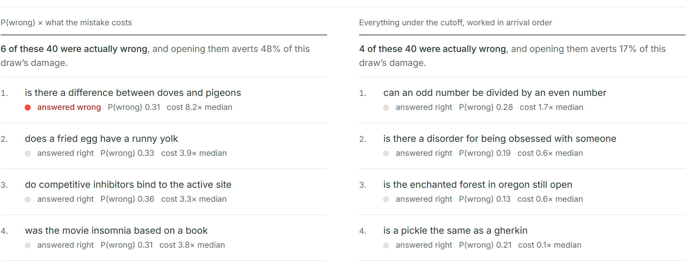

# Review Budget

**Your reviewers have four hours. Which cases should they open?**

An AI made 400 decisions. Your team has time to check 40 of them.

Review Budget ranks the cases where being wrong would hurt the most. In this experiment,
spending the same four hours that way prevented about three times the damage that reviewing
everything below a fixed confidence cutoff prevented.

**[Try the live demo →](https://jfkconstruct.github.io/review-budget/demo.html)**

Drag the hours dial, switch the model, read the limits panel. Nothing is installed and
nothing leaves your browser.



---

## The idea in 30 seconds

The least confident AI decision is not always the one most worth reviewing.

```
chance the AI is wrong  x  what the mistake costs  =  review priority
```

An example with made-up dollars:

```
Case A   10% chance wrong  x  $100 consequence  =  $10 at risk
Case B   40% chance wrong  x    $5 consequence  =   $2 at risk
```

Open Case A first. A confidence cutoff would send your reviewer to Case B.

## Same four hours, different outcome

```
                 SAME 40 REVIEWS

Fixed confidence cutoff          Review Budget
-----------------------          -------------
4 mistakes found                 6 mistakes found
17% of the damage prevented      48% of the damage prevented
```

Same model. Same queue. Same human review budget. Only the ranking policy changed.

The cutoff list is every case the model was under 90% sure about, worked in arrival order.
The Review Budget list is ranked by chance-wrong times cost. They barely overlap.

Those are the numbers on one cost draw, the one in the screenshot. Across 2,000 resampled
draws the gap holds: about a sixth of the queue's damage prevented under the cutoff, about
half under Review Budget, and Review Budget wins in 96% of draws.

## Where this came from

I ran into this problem in estimating.

A quote goes out on a commercial job. Behind it sit drawings, equipment schedules,
specifications, and three revisions of each. Someone is supposed to reread all of it before
the quote is sent, and nobody has the hours.

An AI can flag the places that do not line up. But a flag is only worth a reviewer's time if
the number behind it means something. A model that says "80% sure" and is right 60% of the
time sends your reviewer to the wrong cases and lets the expensive mistake through.

The domain is specific. The allocation problem is not. Insurance claims, financial reviews,
fraud queues, document checks, AI-generated work, support escalations: whenever AI can
process more cases than humans can inspect, someone decides where human review is worth the
most. Review Budget turns limited human review time into a ranked queue: check these cases
first.

## How I tested it

Two questions, in order. The second only matters if the first passes.

**1. Does the model's confidence mean what it says?** Three models answered 400 public
yes/no questions with a known answer key, each reporting how sure it was. One of the three
is calibrated well enough to auto-decide 95% of the queue at 95% precision. The other two
manage 36% and 0%. Details in [RESULTS.md](RESULTS.md).

**2. Given honest probabilities, what do four reviewer hours buy?** Five ways of choosing
which 40 cases to open, from random to an oracle that already knows the answers, run over
2,000 resampled cost draws and three cost shapes. Details in [QUEUE.md](QUEUE.md).

## What happened

| question | answer |
|---|---|
| Does confidence mean what it says? | For one model, yes. For two, no: a cutoff on their confidence would be a cutoff on noise. |
| What do four hours buy? | Spent on expected harm, about half the queue's damage. Spent on a fixed cutoff, about a sixth. |
| Does counting errors tell you this? | No. Confidence-only triage catches more wrong answers than Review Budget and still prevents less damage. The scoreboard is damage, not count. |

## Limitations

The screen carries these with the same weight as the results, and so does this file.

- **The costs are synthetic.** Nobody has a price on a wrong BoolQ answer, so three cost
  shapes are drawn and every policy sees the same draw. The direction of the result is
  measured. The size is not.
- **The reviewer is assumed perfect.** Every opened case is fixed. That is an upper bound,
  applied equally to every policy.
- **The task is one benchmark.** 400 public yes/no questions with an answer key. The answer
  key is the only reason a number exists here. A demo on your own documents could not be
  checked, so this repository does not offer one.
- **Thresholds are recorded, never enforced.** A cutoff that sounds high is not a cutoff
  that has been measured. Nothing here gates on a number until a curve is fitted on
  labeled rows.
- **It ranks. Someone accountable opens the case.**

## Reproduce it

Every figure in this repository was written from script output, never by hand. One command
replays the recorded runs and reproduces every number on the screen:

```
python budget.py --replicates 2000
```

From scratch, including the three model runs (needs `OPENROUTER_API_KEY`, costs $0.27 in
total):

```
python fetch_boolq.py --n 400 --seed 0
python bakeoff.py jev  --n 400
python bakeoff.py chat --n 400 --model google/gemini-2.5-flash-lite
python bakeoff.py chat --n 400 --model openai/gpt-5-mini
python score.py
python budget.py --replicates 2000
python export_demo.py --replicates 2000 && python build_demo.py
```

## Files

| file | what it does |
|---|---|
| `demo.html` | the screen: hours dial, model switch, two lists, limits panel |
| `budget.py` | spends a reviewer budget five ways over recorded probabilities |
| `bakeoff.py` | asks each model the 400 questions and records its probability |
| `score.py` | calibration table and reliability bins; fits nothing, gates nothing |
| `fetch_boolq.py` | pulls the labeled sample |
| `export_demo.py`, `build_demo.py` | turn the numbers and the template into `demo.html` |
| `DEMO-SPEC.md` | why the screen shows what it shows, and what was rejected |

## License

MIT
